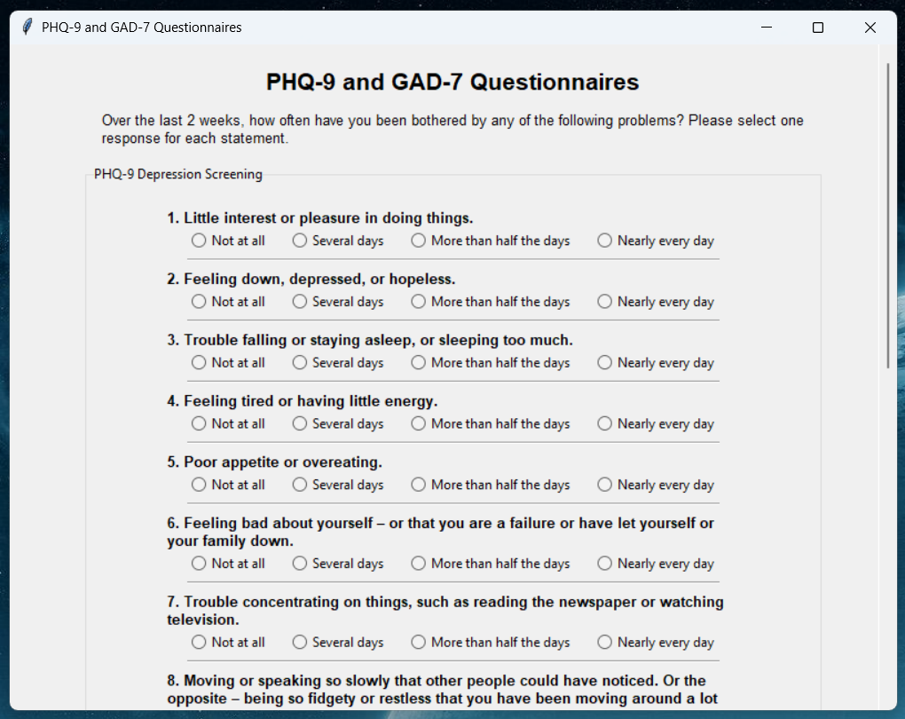
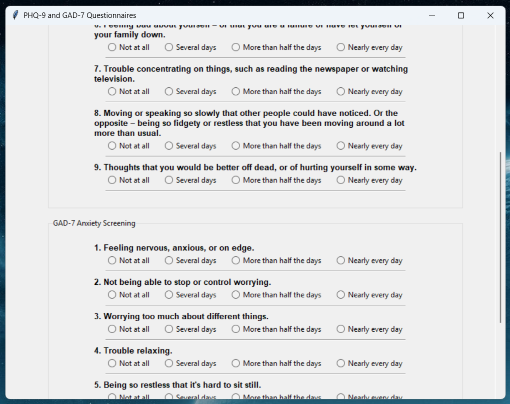
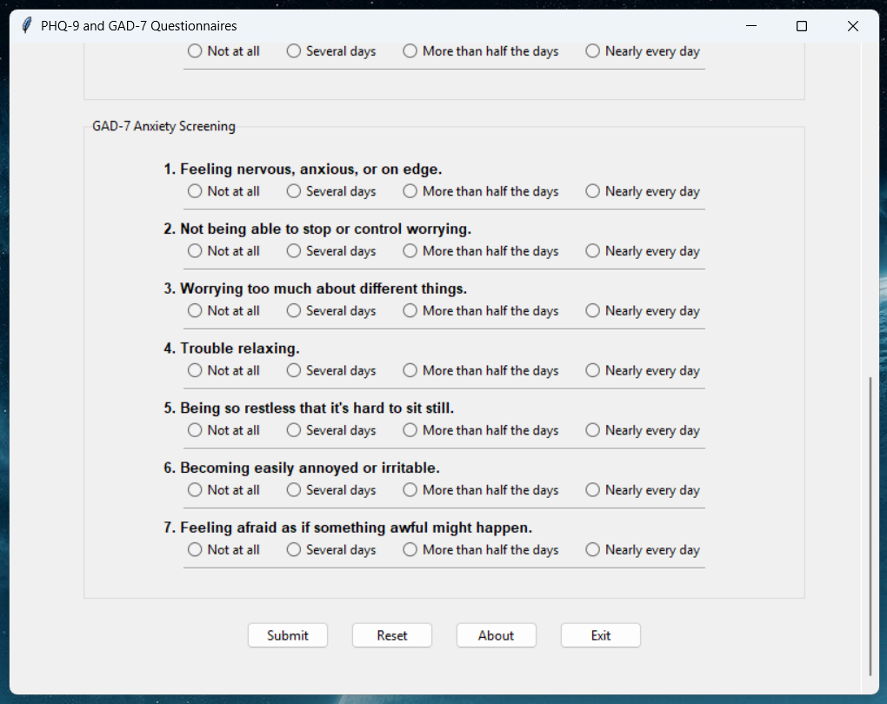

# Patient Health Questionnaire and Generalized Anxiety Disorder Screening Tools

## (PHQ-9 and GAD-7)

### About This Project

This project is a Python implementation of two widely-used mental health screening instruments:

- **PHQ-9** (Patient Health Questionnaire-9): Screens for depression symptoms
- **GAD-7** (Generalized Anxiety Disorder-7): Screens for anxiety symptoms

Both are public domain screening tools developed by Drs. Spitzer, Kroenke, Williams, and Löwe.





---

### Three Programming Paradigms

This project demonstrates the same functionality implemented in three different ways:

1. **Procedural** - Sequential code with loops 
2. **Functional** - Modular functions
3. **Object-oriented** - Event-driven GUI with Tkinter

---

### Educational Purpose

This is a programming exercise created for educational purposes to demonstrate different coding approaches. It is **not intended for clinical use or self-diagnosis**. If you have mental health concerns, please consult a qualified healthcare professional.

---

### Features

- Interactive CLI and GUI
- Input validation
- Automated scoring
- Severity level interpretation

---

### Requirements

- Python 3.x (no additional packages required for CLI)
- Tkinter (for GUI)

---

### Installation

```bash
git clone https://github.com/DuckDodgers24/Paul_S_McAlduff.git
cd Paul_S_McAlduff/projects/python/phq_gad
```
---

### Usage

Run any version directly:
```bash
python phq_gad_procedural.py
python phq_gad_functional.py
python phq_gad_oop_gui.py
```

Or if Python is associated with .py files on your system, double-click the file.

---

### Crisis Resources

If you're experiencing thoughts of self-harm:

- **988 Suicide & Crisis Lifeline** (US)
- **Emergency: 911**
- Visit your nearest emergency room

---

### License

This implementation is provided for educational purposes. The PHQ-9 and GAD-7 instruments are in the public domain.

---

### Disclaimer

These screening tools cannot diagnose mental health conditions. Results should not be used for self-diagnosis or treatment decisions. Always consult qualified healthcare professionals for proper evaluation and care.

---

### References

- Kroenke, K., Spitzer, R. L., & Williams, J. B. (2001). The PHQ-9: validity of a brief depression severity measure. *Journal of General Internal Medicine*, 16(9), 606-613.
- Spitzer, R. L., Kroenke, K., Williams, J. B., & Löwe, B. (2006). A brief measure for assessing generalized anxiety disorder: the GAD-7. *Archives of Internal Medicine*, 166(10), 1092-1097.

---

## Author

**Paul S. McAlduff**  
GitHub: https://github.com/PaulMcAlduff
